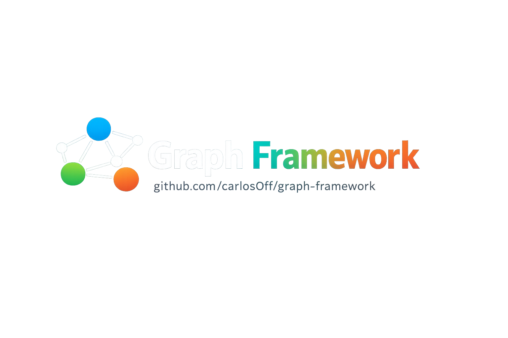
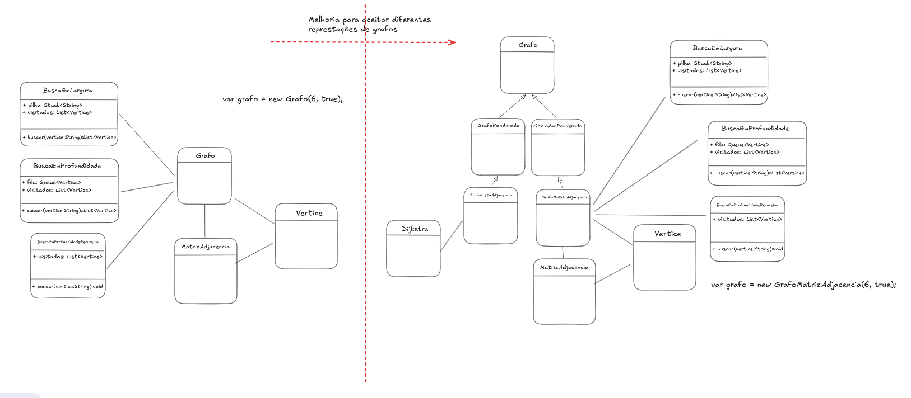
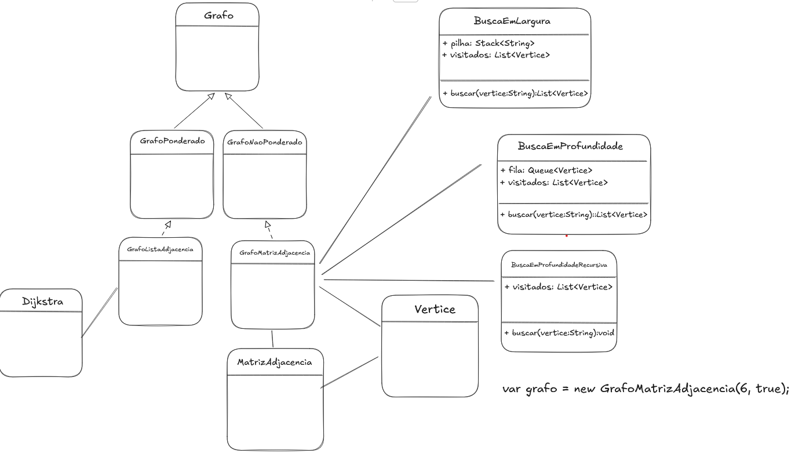
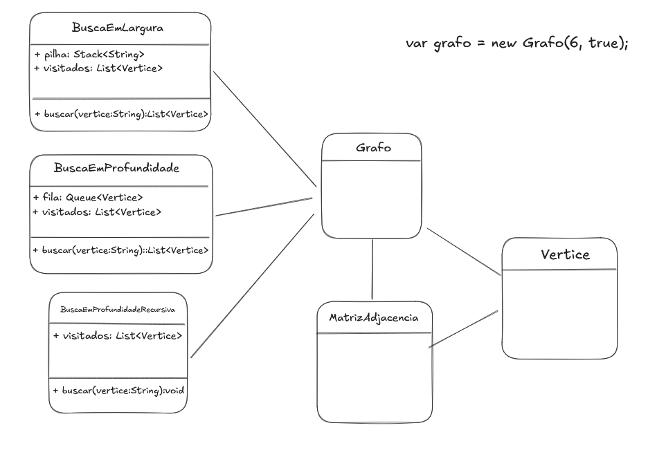

<div align="center">



# graph-framework

> Biblioteca de algoritmos e estruturas de grafos implementada em PHP puro.

[](https://github.com/carlos0ff/graph-framework/stargazers)
[](https://github.com/carlos0ff/graph-framework/network/members)
[](https://github.com/carlos0ff/graph-framework/issues)
[](https://github.com/carlos0ff/graph-framework/blob/master/LICENSE)
[](#)
[](https://www.linkedin.com/in/thiago-rodrigues-172910152/)

</div>

---

## Índice

- [Sobre o projeto](#sobre-o-projeto)
- [Funcionalidades](#funcionalidades)
- [Requisitos](#requisitos)
- [Instalação](#instalação)
- [Uso rápido](#uso-rápido)
- [Estrutura do projeto](#estrutura-do-projeto)
- [Arquitetura](#arquitetura)
- [Exemplos](#exemplos)
- [Testes](#testes)
- [Exercício Final 2026.1](#exercício-final-20261)
- [Documentação](#documentação)
- [Licença](#licença)

---

## Sobre o projeto


Este projeto nasceu na cadeira de **Teoria dos Grafos** (CCO/UNIPÊ, 2026.1), onde as estruturas e algoritmos foram implementados originalmente em Java. A proposta foi recriar tudo do zero em PHP como exercício para validar e fixar o aprendizado dos conceitos, estruturas de dados e algoritmos clássicos sobre grafos.

A biblioteca é **sem dependências externas** — apenas PHP puro e Composer para autoload e testes.

---

## Funcionalidades

| Algoritmo / Estrutura | Descrição | Status |
|---|---|:---:|
| Lista de adjacência | Representação principal do grafo | ✅ |
| Matriz de adjacência | Representação alternativa | ✅ |
| Busca em Largura (BFS) | Traversal nível a nível com fila | ✅ |
| Busca em Largura Imperativa | BFS com `SplQueue` (O(1) enqueue) | ✅ |
| Dijkstra | Caminho mínimo em grafos ponderados | 🚧 |
| Busca em Profundidade (DFS) | Traversal com pilha / recursão | 📋 |
| Detecção de ciclo | Verificação de ciclos em grafos | 📋 |
| Componentes conexas | Listagem de componentes | 📋 |
| Ordenação topológica | Ordenação de DAG (Kahn / DFS) | 📋 |

> Os itens 📋 estão descritos como exercícios práticos em [`docs/exercicios/`](docs/exercicios/README.md) — com esqueleto de classe e `// TODO` para implementar.

---

## Requisitos

- PHP `^8.2`
- [Composer](https://getcomposer.org/)

---

## Instalação

```bash
git clone git@github.com:carlos0ff/graph-framework.git
cd graph-framework
composer install
```

---

## Uso rápido

### Criar um grafo e adicionar vértices/arestas

```php
use Algorithms\Graph\Graph;

// Graph(capacidade máxima, direcionado?)
$grafo = new Graph(10, false);

$grafo->addVertice("A");
$grafo->addVertice("B");
$grafo->addVertice("C");

$grafo->addAresta("A", "B");        // peso padrão = 1
$grafo->addAresta("B", "C", 5);    // peso = 5
```

### Busca em Largura (BFS)

```php
use Algorithms\Graph\Algorithms\BuscaLarguraImperativa;

$bfs = new BuscaLarguraImperativa($grafo);
$visitados = $bfs->buscar("A");

foreach ($visitados as $vertice) {
    echo $vertice->getRotulo() . "\n"; // A, B, C
}
```

### Matriz de adjacência

```php
use Algorithms\Graph\AdjacencyMatrix;

$vertices = $grafo->getVertices();
$matriz   = new AdjacencyMatrix($vertices, false);

$matriz->conectarVertices(0, 1);    // A — B
$matriz->conectarVertices(1, 2, 5); // B — C, peso 5
$matriz->imprimir();
```

Para rodar o exemplo completo:

```bash
php main.php
```

Saída da execução:



---

## Estrutura do projeto

```
graph-framework/
├── main.php                            # Ponto de entrada de demonstração
├── src/
│   ├── Graph/
│   │   ├── Graph.php                   # Grafo por lista de adjacência
│   │   ├── Vertex.php                  # Vértice (rótulo, grau, entrada, saída)
│   │   ├── Edge.php                    # Aresta (destino + peso)
│   │   ├── AdjacencyMatrix.php         # Representação por matriz n×n
│   │   ├── Contracts/
│   │   │   └── GraphInterface.php      # Contrato das operações do grafo
│   │   ├── Exceptions/
│   │   │   ├── GraphException.php      # Exceção base
│   │   │   ├── QtdeMaximaException.php # Capacidade de vértices excedida
│   │   │   └── VertexNotFoundException.php
│   │   └── Algorithms/
│   │       ├── BuscaLargura.php        # BFS com array
│   │       ├── BuscaLarguraImperativa.php # BFS com SplQueue
│   │       └── Dijkstra.php            # Caminho mínimo (em construção)
│   └── Utils/
│       └── Printer.php                 # Impressão do grafo no console
├── examples/
│   ├── 01-grafo-nao-direcionado.php
│   ├── 02-grafo-direcionado.php
│   └── 03-matriz-adjacencia.php
├── tests/
│   └── Graph/
│       ├── GraphTest.php
│       ├── EdgeTest.php
│       └── VertexTest.php
└── docs/
    ├── assets/
    │   ├── images/                     # Diagramas UML e capturas de tela
    │   └── pdfs/                       # Enunciados e materiais de apoio
    └── exercicios/
        ├── *.php                       # Exercícios práticos (esqueleto)
        └── final/                      # Resoluções do Exercício Final
```

---

## Arquitetura

<div align="center">

| Diagrama completo | Diagrama simplificado |
|:---:|:---:|
| [](docs/assets/images/diagrama-uml-completo.png) | [](docs/assets/images/diagrama-uml-simplificado.png) |
| Hierarquia completa de classes | Grafo, Matriz, Vértice e Buscas |

</div>

O grafo principal (`Graph`) implementa `GraphInterface` e usa **lista de adjacência** (`array<string, Edge[]>`). A `AdjacencyMatrix` é uma representação alternativa independente, útil para algoritmos matriciais. Os algoritmos recebem um `Graph` por injeção no construtor.

---

## Exemplos

A pasta [`examples/`](examples/) contém scripts prontos:

```bash
php examples/01-grafo-nao-direcionado.php
php examples/02-grafo-direcionado.php
php examples/03-matriz-adjacencia.php
```

---

## Testes

```bash
composer test
# ou diretamente
vendor/bin/phpunit
```

Cobertura atual: **10 testes · 18 asserções** — `Graph`, `Vertex` e `Edge`.

---

## Exercício Final 2026.1

Resoluções das 4 questões da avaliação final da disciplina:

| Questão | Tema | Arquivo |
|---|---|---|
| 1 | Dijkstra em G1 e G2 | [`Questao1Dijkstra.php`](docs/exercicios/final/Questao1Dijkstra.php) |
| 2 | BFS + DFS — menor caminho a→z | [`Questao2BuscasCaminho.php`](docs/exercicios/final/Questao2BuscasCaminho.php) |
| 3 | Logística com BFS e matriz de adjacência | [`Questao3LogisticaBFS.php`](docs/exercicios/final/Questao3LogisticaBFS.php) |
| 4 | Componentes conexas | [`Questao4ComponentesConexas.php`](docs/exercicios/final/Questao4ComponentesConexas.php) |

**Materiais:**

- [Enunciado — Exercício Final 2026 (PDF)](docs/assets/pdfs/Exercicio-Final-2026.pdf)
- [Material de apoio — Dijkstra (PDF)](docs/assets/pdfs/Exercício%20Dijkstra.pdf)

---

## Documentação

A documentação completa está em [`docs/README.md`](docs/README.md), com descrição das classes, exercícios práticos e instruções de uso.

---

## Licença

Distribuído sob a licença MIT. Veja [LICENSE](LICENSE) para mais detalhes.
