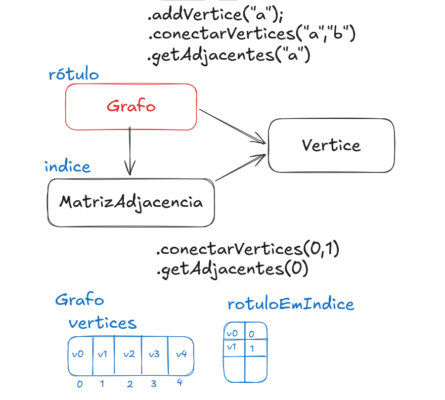

# Documentação

## Estrutura do projeto

```
graph-algorithms/
├── main.php                  # Exemplo de uso da biblioteca
├── src/
│   ├── Graph/
│   │   ├── Graph.php          # Implementação concreta do grafo (lista de adjacência)
│   │   ├── Vertex.php          # Vértice do grafo
│   │   ├── Edge.php            # Aresta do grafo (destino + peso)
│   │   ├── AdjacencyMatrix.php # Representação alternativa por matriz de adjacência
│   │   ├── Contracts/
│   │   │   └── GraphInterface.php # Contrato implementado por Graph
│   │   ├── Exceptions/
│   │   │   ├── GraphException.php
│   │   │   ├── QtdeMaximaException.php
│   │   │   └── VertexNotFoundException.php
│   │   └── Algorithms/
│   │       ├── BuscaLargura.php           # BFS (fila com array)
│   │       ├── BuscaLarguraImperativa.php # BFS (fila com SplQueue)
│   │       └── Dijkstra.php               # Caminho mínimo (em construção)
│   └── Utils/
│       └── Printer.php        # Impressão de um Graph no console
├── tests/                      # Testes PHPUnit (vendor/bin/phpunit)
└── docs/
    ├── images/                 # Imagens usadas nesta documentação
    └── exercicios/             # Exercícios práticos (ver exercicios/README.md)
```

## Conceitos principais

- **`Vertex`**: representa um vértice, com rótulo e graus (total, entrada, saída).
- **`Edge`**: representa uma aresta para um `Vertex` de destino, com peso.
- **`Graph`**: implementa `Contracts\GraphInterface` usando uma lista de
  adjacência (`array<string, Edge[]>`). Cada vértice é identificado pelo seu
  rótulo (`string`).
  - `addVertice(string $rotulo): Vertex` — adiciona um vértice; lança
    `QtdeMaximaException` se o grafo já atingiu a capacidade máxima definida
    no construtor.
  - `addAresta(string $origem, string $destino, int $peso = 1): void` —
    adiciona uma aresta entre dois vértices existentes; lança
    `VertexNotFoundException` se algum dos rótulos não existir. Se o grafo
    não for direcionado, a aresta de volta também é criada.
  - `getVertice`, `getVertices`, `getArestas`, `getAdjacentes` — consultas
    sobre o grafo, usadas pelos algoritmos de busca.
- **`AdjacencyMatrix`**: representação alternativa do grafo por matriz,
  independente de `Graph`.

## Algoritmos

- **BFS** (`BuscaLargura` e `BuscaLarguraImperativa`): percorrem o grafo em
  largura a partir de um vértice, retornando a ordem de visitação.
- **Dijkstra**: estrutura inicial criada; o cálculo das distâncias mínimas
  ainda precisa ser implementado (veja `docs/exercicios/`).

## Exemplo de saída

A imagem abaixo mostra um exemplo de execução do `main.php`:


Representação visual de um grafo:



## Próximos passos / exercícios

A pasta [`exercicios/`](exercicios/README.md) contém exercícios práticos
(DFS, detecção de ciclo, componentes conexas, ordenação topológica e
conclusão do Dijkstra) para quem quiser praticar sobre esta base de código.
