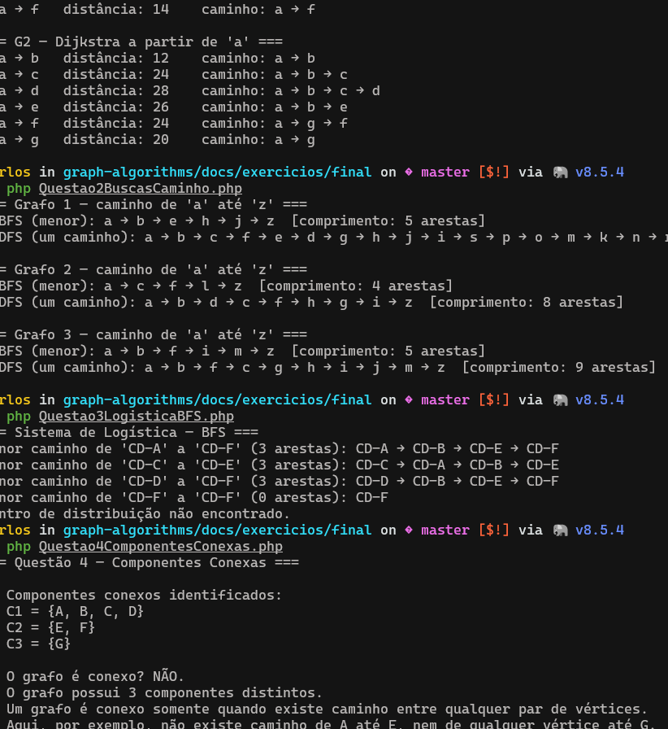
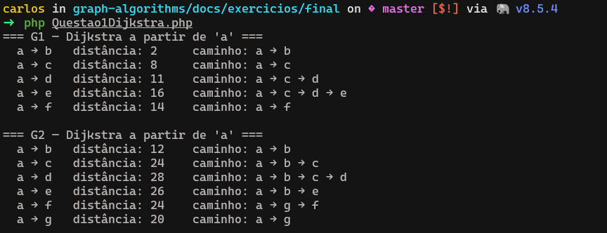
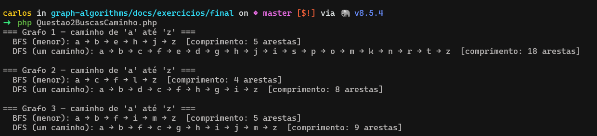
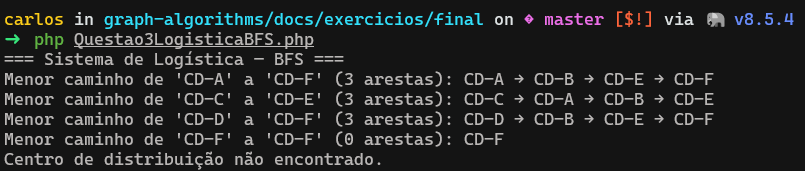
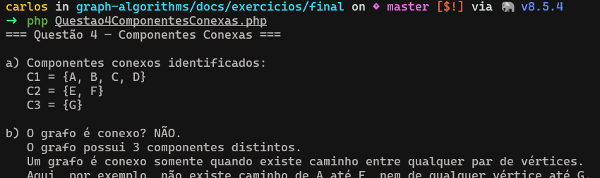
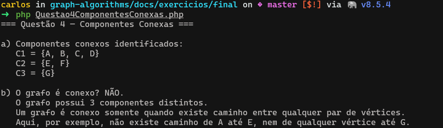

# Exercício Final — Teoria dos Grafos 2026.1

Arquivos referentes ao **Exercício Final** da disciplina Teoria dos Grafos (CCO/UNIPÊ, 2026.1).
O enunciado completo está em [`../../assets/pdfs/Exercicio-Final-2026.pdf`](../../assets/pdfs/Exercicio-Final-2026.pdf).

## Estrutura

| Arquivo | Questão | Algoritmo | Linguagem |
|---------|---------|-----------|-----------|
| [`Questao1Dijkstra.php`](Questao1Dijkstra.php) | 1 — Dijkstra em G1 e G2 | Dijkstra | PHP |
| [`Questao2BuscasCaminho.php`](Questao2BuscasCaminho.php) | 2 — Menor caminho a→z | BFS + DFS | PHP |
| [`Questao3LogisticaBFS.java`](Questao3LogisticaBFS.java) | 3 — Logística com BFS | BFS + matriz de adjacência | Java |
| [`Questao4ComponentesConexas.php`](Questao4ComponentesConexas.php) | 4 — Componentes conexas | BFS | PHP |

## Como executar

### PHP (questões 1, 2 e 4)

```bash
# a partir da raiz do projeto
composer dump-autoload

php docs/exercicios/final/Questao1Dijkstra.php
php docs/exercicios/final/Questao2BuscasCaminho.php
php docs/exercicios/final/Questao4ComponentesConexas.php
```

### Java (questão 3)

```bash
cd docs/exercicios/final
javac Questao3LogisticaBFS.java
java  Questao3LogisticaBFS
```

## Saídas



## Resumo das respostas

### Questão 1 — Dijkstra

Executa o algoritmo de Dijkstra a partir de **"a"** nos grafos G1 (6 vértices) e G2 (7 vértices),
exibindo a distância mínima e o caminho reconstruído até cada vértice.



### Questão 2 — BFS e DFS

- **BFS** garante o caminho com **menor número de arestas** de "a" até "z".
- **DFS** encontra **um** caminho (não necessariamente o menor) por backtracking recursivo.
- Os três grafos são não direcionados e sem peso.



### Questão 3 — Logística (Java)

Grafo não direcionado representado por **matriz de adjacência**.
BFS encontra o menor caminho em arestas entre dois centros de distribuição.
Se não existir caminho, o programa informa adequadamente.



### Questão 4 — Componentes Conexas

```
V = {A, B, C, D, E, F, G}
E = {(A,B), (A,C), (B,C), (C,D), (E,F)}
```

- **a)** Componentes: C1 = {A, B, C, D} · C2 = {E, F} · C3 = {G}
- **b)** O grafo **não é conexo** — possui 3 componentes. Não existe caminho entre A e E,
  nem de qualquer vértice até G.



